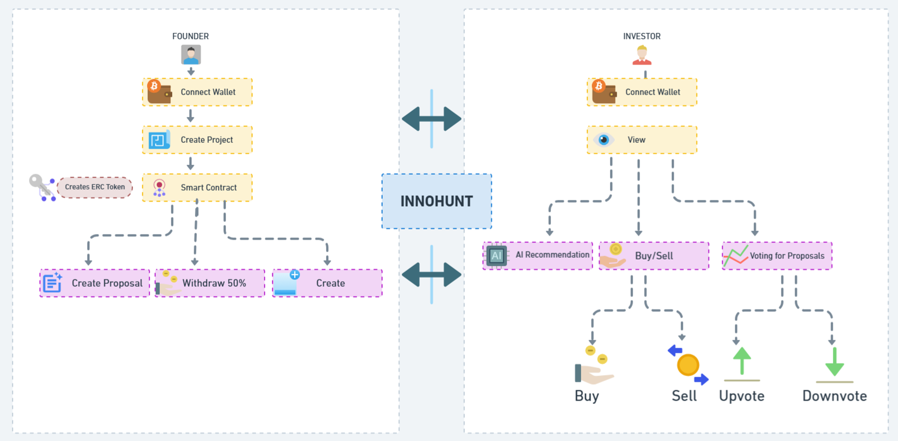
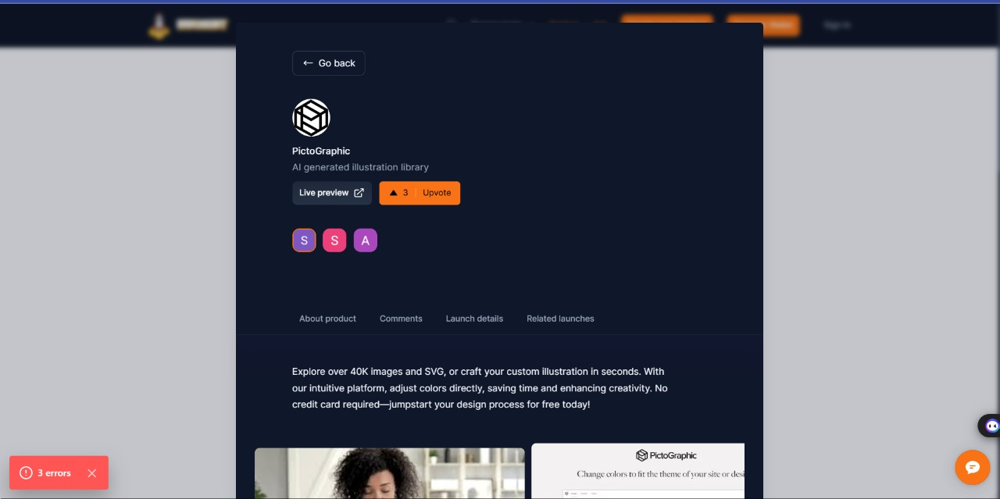
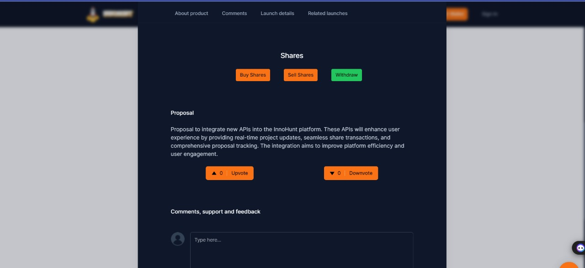
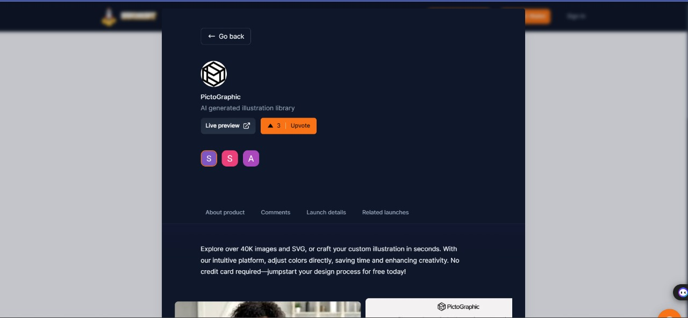
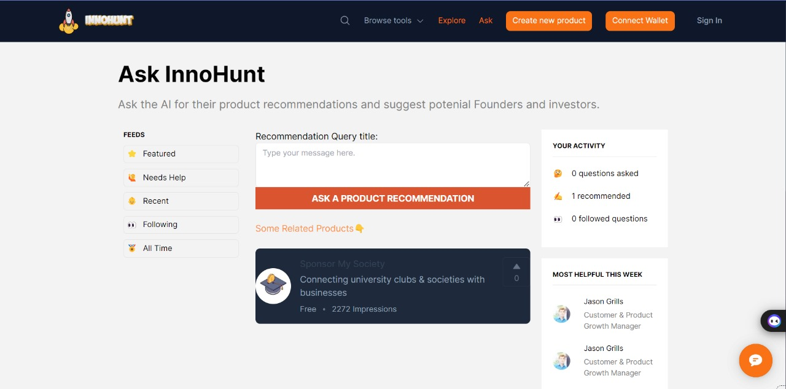
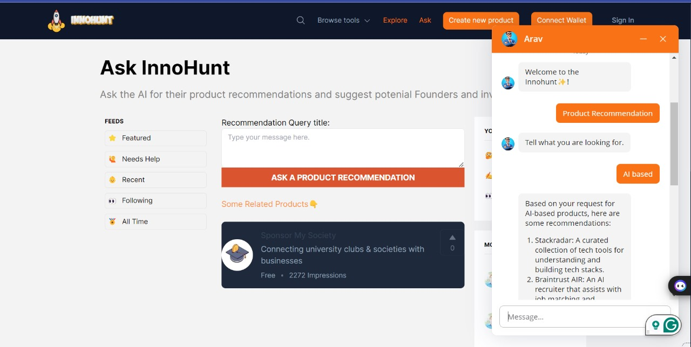
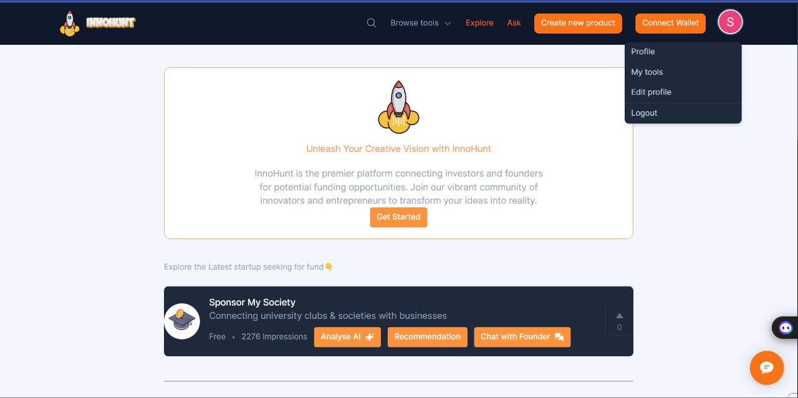
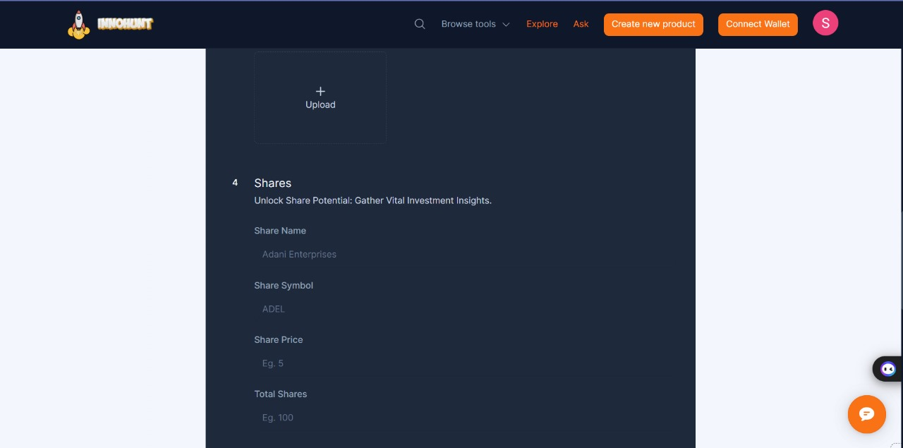
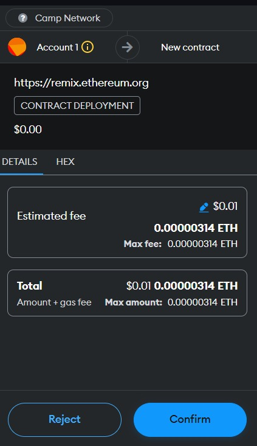

# INNOHUNT ⛏️

## Output
https://github.com/sanjail3/Innohunt-Hackathon/assets/131733014/cfa6c444-13be-451f-a112-b30ac2a73df2

## Table of Contents
1. [Problem Statement](#1-problem-statement)
   - [For Founders](#for-founders)
   - [For Investors](#for-investors)
2. [Platform Onboarding](#2-platform-onboarding)
   - [For Founders](#for-founders-1)
   - [For Investors](#for-investors)
3. [Project Listing and Discovery](#3-project-listing-and-discovery)
   - [On the Platform](#on-the-platform)
4. [Due Diligence and Evaluation](#4-due-diligence-and-evaluation)
   - [For Investors](#for-investors-1)
5. [Funding Commitment](#5-funding-commitment)
   - [For Investors](#for-investors-2)
6. [Smart Contracts and Fund Release](#6-smart-contracts-and-fund-release)
   - [On the Platform](#on-the-platform-1)
7. [Milestone-Based Funding](#7-milestone-based-funding)
   - [For Founders](#for-founders-2)
   - [On the Platform](#on-the-platform-2)
8. [Post-Investment Management](#8-post-investment-management)
   - [For Investors](#for-investors-3)
9. [Exit Strategies](#9-exit-strategies)
   - [For Investors](#for-investors-4)
10. [Compliance and Reporting](#10-compliance-and-reporting)
   - [On the Platform](#on-the-platform-3)
11. [Output](#output)

## 1. Problem Statement

### For Founders:
- **Idea Development**: Develop a solid business idea and create a detailed business plan.
- **Market Research**: Conduct thorough market research to validate the idea and identify the target audience.
- **Team Formation**: Assemble a competent team with the skills necessary to execute the project.
- **Prototyping**: Develop a prototype or minimum viable product (MVP) to demonstrate the concept.

### For Investors

Investors encounter several significant challenges when looking to invest in startups and emerging ventures, including:

**1. Identifying High-Quality Investment Opportunities**
- Difficulty in discovering promising startups among numerous options.high-risk ventures.

**2. Trust and Credibility Issues**
- Concerns about the legitimacy and credibility of founders and their projects.

**3. Time-Consuming Due Diligence**
- The due diligence process can be lengthy and resource-intensive.

**4. Regulatory Compliance**
- Navigating complex regulatory landscapes across different jurisdictions.

**5. Efficient Use of Funds**
- Monitoring how effectively startups use invested funds.

**6. Visibility and Liquidity**
- Limited visibility into the ongoing performance and progress of startups.

## Flow Chart

## 2. Platform Onboarding

### For Founders:
- **Profile Creation**: Create a detailed profile on the platform, including information about the project, team, and business plan.
- **Documentation**: Upload necessary documents such as whitepapers, financial projections, and legal agreements.
- **Pitch Preparation**: Prepare a compelling pitch to attract potential investors.

### For Investors:
- **Profile Creation**: Investors create a profile on the platform, outlining their investment preferences and criteria.
- **Verification**: Complete identity verification and accreditation checks to comply with regulatory requirements.

## 3. Project Listing and Discovery

### On the Platform:
- **Project Listing**: Founders list their projects on the platform, making them visible to investors.
- **AI Recommendations**: The platform uses AI to recommend projects to investors based on their preferences and past investments.
- **Search and Filter**: Investors can search for projects using various filters such as industry, stage, and funding requirements.

## 4. Due Diligence and Evaluation

### For Investors:
- **Review**: Investors review project details, documentation, and team backgrounds.
- **Due Diligence**: Conduct thorough due diligence, which may include market analysis, financial assessment, and legal checks.
- **Communication**: Engage with founders through the platform to ask questions and request additional information.

## 5. Funding Commitment

### For Investors:
- **Investment Decision**: Based on the evaluation, investors decide whether to invest in the project.
- **Commitment**: Investors commit to funding by pledging a certain amount on the platform.

## 6. Smart Contracts and Fund Release

### On the Platform:
- **Smart Contract Creation**: A smart contract is created to define the terms of the investment, including milestones, equity distribution, and payment schedules.
- **Fund Transfer**: Investors transfer funds to a secure escrow account managed by the smart contract.

## 7. Milestone-Based Funding

### For Founders:
- **Milestone Achievement**: Founders work towards achieving predefined milestones.
- **Progress Reporting**: Founders update investors on progress and submit evidence of milestone achievement.

### On the Platform:
- **Milestone Verification**: The platform verifies that milestones have been achieved, either through automated checks or manual review.
- **Fund Release**: Upon verification, the smart contract releases funds to the founders as per the agreed schedule.

## 8. Post-Investment Management

### For Investors:
- **Monitoring**: Investors monitor the project's progress through regular updates and reports provided on the platform.
- **Engagement**: Investors may provide mentorship, advice, or additional resources to help the project succeed.

## 9. Exit Strategies

### For Investors:
- **Exit Planning**: Investors plan their exit strategy, which could be through selling their equity, a public offering, or acquisition.
- **Secondary Market**: If the platform supports tokenization, investors can sell their equity tokens on a secondary market for liquidity.

## 10. Compliance and Reporting

### On the Platform:
- **Regulatory Compliance**: Ensure all transactions and activities comply with relevant regulations.
- **Reporting**: Provide necessary reports to regulatory bodies, investors, and other stakeholders.

## Utilizing Blockchain in This Process:

- **Transparency**: Blockchain ensures all transactions and contract terms are transparent and immutable, reducing the risk of fraud.
- **Smart Contracts**: Automate fund releases, compliance checks, and milestone verification, increasing efficiency and trust.
- **Tokenization**: Facilitate liquidity and fractional ownership through tokenized equity or assets.
- **Decentralization**: Reduce reliance on intermediaries, lowering costs and increasing access for global participants.

## Output

